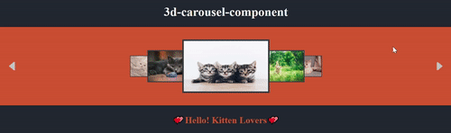

# 3d-carousel-component

- A classy 3d carousel for react.js;✨💞
  

# Table of Contents

- [Getting Started🚀](#getting-started)
- [Customization🔥](#customization)
- [Examples👾](#examples)
- [Issues??🐛](#issues)
- [Special Mention💕](#special-mention)

## Getting Started🚀

**`npm i 3d-carousel-component`**

```javascript
import Carousel3D from "3d-carousel-component";

const YourComponent = () => {
  return (
    <Carousel3D
      ContainerStyle={ContainerStyle}
      CardStyle={CardStyle}
      CardList={CardList}
    />
  );
};
```

## Customization🔥

- Basically you have to pass three props, Namely:
  - ContainerStyle
  - CardStyle
  - CardList
- Out of this first two are for styling and last one contains list of your cards.
- Note all variables, props, properties follow UpperCamelCase Rule.\*

  ### ContainerStyle

  - It allows you to style the main outer container of carousel.
  - Following properties are available:

  | Key             | Function                               |
  | :-------------- | :------------------------------------- |
  | Width           | Width of the main container            |
  | Height          | Height of the main container           |
  | Padding         | Padding of the main container          |
  | Margin          | Margin of the main container           |
  | BackgroundColor | Background color of the main container |
  | Background      | Background property                    |

  - Look at the example below for more understanding.

  ### CardStyle

  - It allows you to style each card of the carousel.
  - Following properties are available:

  | Key         | Function                          |
  | :---------- | :-------------------------------- |
  | Width       | Width of each Card                |
  | Height      | Height of each Card               |
  | Padding     | Padding inside of your Card       |
  | AspectRatio | Defines Aspect ratio of your Card |

  - Look at the example below for more understanding.

  ### CardList

  - It bassically an array of objects with _"element"_ key containing content of your card. (Can be anyting you wish to have 😉)

## Examples👾

```javascript
import Carousel3D from  "3d-carousel-component";

const YourComponent  =  ()  =>  {
	//List of element you want inside carousel.
	const  CardList  = [
		{ element:  <div>Card 1</div>, },
		{ element:  <div>Card 2</div>, },
		{ element:  <div>Card 3</div>, },
		{ element:  <div>Card 4</div>, },
		{ element:  <div>Card 5</div>, },
		{ element:  <div>Card 6</div>, },
		{ element:  <div>Card 7</div>, },
		{ element:  <div>Card 8</div>, },
	];
	const ContainerStyle = {
		BackgroundColor:  "Cyan",
		Width:  "100%",
		Padding:  "1em",
		Margin:  "auto",
	};
	const CardStyle = {
		Width:  "100%",
		BackgroundColor: "blanchedalmond",
		Padding:  "0.5em 1em",
	};

	return  <Carousel3D
			ContainerStyle={ContainerStyle}
			CardStyle={CardStyle}
			CardList={CardList}
		/>;
};

export defalut YourComponent;
```

## Issues??🐛

- Having any issues or found any bugs, feel free to reach me on github.📧

## Special Mention💕

- Special Thanks to [Akshit Gupta](https://github.com/AkshitGuptaIITR) for the constant motivation and support.
